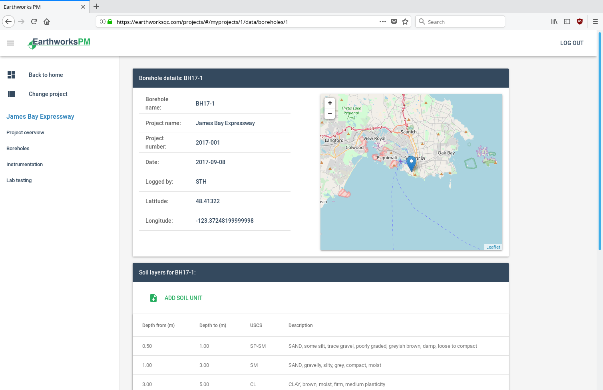

# earthworks-demo
Prototype for a data management platform for engineers

## Geotechnical asset management
Earthworks PM helps engineers manage geotechnical and geological data for site evaluations and earthworks construction projects.

Projects can be created and data entered on any desktop or mobile system with a modern browser. Because data is fetched and stored using an API server, future support can be added for other platforms such as a standalone mobile or desktop app.

The PostgreSQL database and API server (based on Django) is currently hosted at [https://earthworksqc.com/](https://earthworksqc.com/). However, it can be installed to a local machine in order to keep data contained within a local network. Please see [installation instructions](./installation.md).
